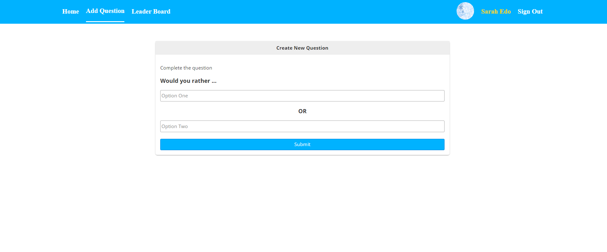

# Would You Rather Project

This is my implementation for the final assessment project for Udacity's Redux and React course.

## How to start?

- install all project dependencies with `npm install`
- start the development server with `npm start`

## Redux Actions

- **SET_AUTHED_USER**
- **UNSET_AUTHED_USER**
- **RECEIVE_POLLS**
- **RECEIVE_USERS**
- **USER_ADDS_NEW_POLL**
- **USER_ANSWERS_POLL**

## Redux State

- **polls**
- **users**
- **authedUser**

## Snapshots

## Create React App

This project was bootstrapped with [Create React App](https://github.com/facebookincubator/create-react-app). You can find more information on how to perform common tasks [here](https://github.com/facebookincubator/create-react-app/blob/master/packages/react-scripts/template/README.md).
